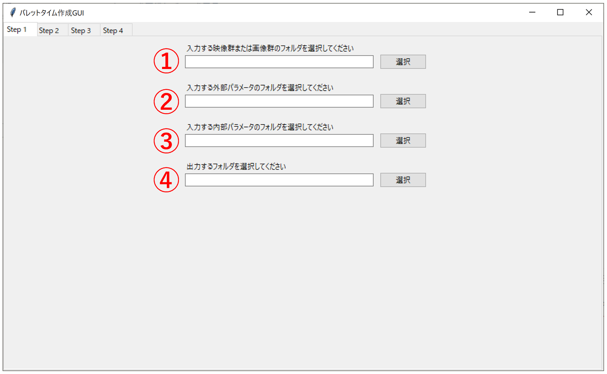

# app
デモ用のサンプルデータはクラスルームの松田のdriveより、"研究共有 > 研究資料 > デモ用サンプルデータ"内のzipファイルをダウンロードして下さい。

main.pyを実行してGUIを表示。

1番のフォームに画像または動画ファイルの入ったフォルダのパスを指定

例：img_A, video_A

2番のフォームに外部パラメータの入ったフォルダのパスを指定

例：external_A

3番のフォームに内部パラメータの入ったフォルダのパスを指定

例：internal

4番のフォームに出力するフォルダのパスを指定（フォルダを用意する）
